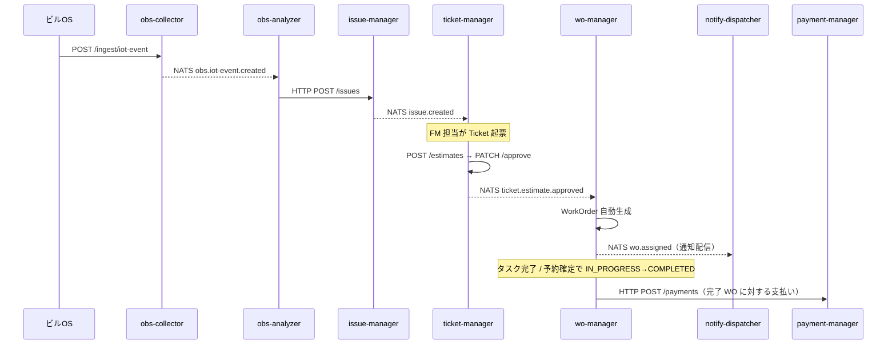

# workorder-impl

> **建物 FM（ファシリティマネジメント）ワークオーダー管理 System-of-Systems の実装モノレポ**
> IoT イベント / 報告 から Issue・Ticket・WorkOrder・Payment までを自動連鎖させる、NATS 駆動のマイクロサービス群。

---

## 目次

- [1. 概要](#1-概要)
- [2. 3 リポジトリ構成](#2-3-リポジトリ構成)
- [3. アーキテクチャ](#3-アーキテクチャ)
- [4. サービスカタログ](#4-サービスカタログ)
- [5. エンドツーエンドのデータフロー](#5-エンドツーエンドのデータフロー)
- [6. NATS サブジェクト一覧](#6-nats-サブジェクト一覧)
- [7. リポジトリ構成](#7-リポジトリ構成)
- [8. 技術スタック](#8-技術スタック)
- [9. クイックスタート](#9-クイックスタート)
- [10. テスト](#10-テスト)
- [11. アーキテクチャガバナンス](#11-アーキテクチャガバナンス)
- [12. コネクタ拡張](#12-コネクタ拡張)
- [13. 実装状況](#13-実装状況)
- [14. 本番運用に向けた残課題](#14-本番運用に向けた残課題)
- [15. OWL スキーマ対応メモ](#15-owl-スキーマ対応メモ)

---

## 1. 概要

`workorder-impl` は、建物 FM のワークオーダー管理を担う **10 個の Component System (CS)** と
共有スキーマパッケージ (`gutp-shared`) を 1 つの uv ワークスペースに収めた実装モノレポです。

中核となる業務連鎖は次のとおりです。

```
IoTEvent  →  Issue  →  Ticket → Estimate(承認)  →  WorkOrder  →  Payment
```

各 CS は FastAPI による HTTP API と NATS による非同期イベントで疎結合に連携し、
予防保全スケジュール・緊急 WO・未評価 Report エスカレーション（Issue 生成ではなく通知へ直送）・
運用ダッシュボード（BFF）といった周辺機能も含めて、業務フロー全体を自動化します。

---

## 2. 3 リポジトリ構成

本実装は次の 3 リポジトリで構成される SoS の一部です（兄弟ディレクトリ配置を想定）。

| リポジトリ | 役割 | 本リポジトリとの関係 |
|---|---|---|
| [`workorder-systems`](../workorder-systems) | アーキテクチャ定義（`systems.yaml`：CS / FUN / IF / ADR の正本） | `scripts/validate_arch_sync.py` が整合性を検証 |
| **`workorder-impl`**（本リポジトリ） | 実装モノレポ | — |
| [`workorder-ontologies`](../workorder-ontologies) | OWL オントロジー（`core.ttl` 等） | `shared/gutp/schemas/` が Pydantic v2 で写像 |

> **正本は `workorder-systems`**。CS / 機能要件 (FUN-*) / インターフェース要件 (IF-*) /
> アーキ決定 (ADR-*) はすべて `systems.yaml` で定義され、本リポジトリはそれに追従します。
> ドリフトは CI の `arch-sync` ジョブで検出されます（[§11](#11-アーキテクチャガバナンス)）。

---

## 3. アーキテクチャ

### ドメイン分割（SOI: System-of-Interest）

| SOI | 責務 | 所属 CS |
|---|---|---|
| **SOI-OBS** | 観測・分析（IoT / 報告の収集と評価） | building-registry, obs-collector, obs-analyzer |
| **SOI-WOM** | ワークオーダー管理（Issue 〜 Payment、運用、通知、予防保全） | issue/ticket/wo/payment-manager, ops-dashboard, notify-dispatcher, wo-scheduler |

### 連携方式

- **同期 HTTP (REST)**：CRUD・問い合わせ・サービス間の即時取得（`httpx` 非同期クライアント）
- **非同期 NATS**：イベント駆動の連鎖（疎結合・リトライ・ファンアウト）
- **メッセージバス**：NATS 2.10（`infra/nats/nats-server.conf`）

```
                         ┌─────────── NATS message bus (4222) ───────────┐
                         │                                                │
 building-registry       obs-collector ──► obs-analyzer ──► issue-manager │
   (topology cache)         (ingress)       (rule eval)     (lifecycle)   │
                                                  │              │        │
                                          obs.report.escalation  │ issue.* │
                                                  ▼              ▼        │
                              notify-dispatcher ◄── ticket-manager ──► wo-manager
                                  (email/slack/      (estimate)         (auto WO)
                                   webhook)              │                 │
                                                ticket.estimate.approved  wo.assigned
                                                                           │
                              wo-scheduler ──► (Issue→Ticket→Estimate)  payment-manager
                              (preventive batch)                            │
                                                ops-dashboard (BFF) ◄── HTTP 集約 ──┘
```

---

## 4. サービスカタログ

| サービス | CS-ID | ポート | 種別 | 主な責務 | 主要エンドポイント / イベント |
|---|---|---|---|---|---|
| **building-registry** | CS-BUILDING-REGISTRY | 8000 | API+batch | ビル OS トポロジ同期・参照 | `GET /topology/{buildings,spaces,devices}`, `POST /topology/sync` |
| **obs-collector** | CS-OBS-COLLECTOR | 8001 | API | IoT / 報告 受信（コネクタ） | `POST /ingest/iot-event`, `POST /ingest/report` → publish `obs.*.created` |
| **obs-analyzer** | CS-OBS-ANALYZER | — | worker | ルール評価・未評価 Report エスカレーション | sub `obs.iot-event.created` → HTTP `POST /issues`；sub `obs.report.created` → pending 登録 → publish `obs.report.escalation` |
| **issue-manager** | CS-ISSUE-MANAGER | 8002 | API | Issue ライフサイクル | `POST/GET /issues`, `PATCH /issues/{id}/{review,resolve}` / pub `issue.*` |
| **ticket-manager** | CS-TICKET-MANAGER | 8003 | API | Ticket / Estimate 管理 | `POST /tickets`, `POST /estimates`, `PATCH /estimates/{id}/approve` |
| **wo-manager** | CS-WO-MANAGER | 8004 | API | WO 自動/手動発行・タスク・予約 | sub `ticket.estimate.approved` → 自動 WO / `POST /work-orders/emergency` |
| **payment-manager** | CS-PAYMENT-MANAGER | 8005 | API | 完了 WO の支払い管理 | `POST /payments`, `PATCH /payments/{id}/mark-paid` |
| **ops-dashboard** | CS-OPS-DASHBOARD | 8006 | BFF | フロー集約・問題検出・アクション転送 | `GET /ops/flows`, `GET /ops/problems`, `POST /ops/actions`, `GET /dashboard` |
| **notify-dispatcher** | CS-NOTIFY-DISPATCHER | 8007 | worker | 通知配信（プラガブルアダプタ） | sub `wo.assigned`/`wo.emergency.completed`/`obs.report.escalation` |
| **wo-scheduler** | CS-WO-SCHEDULER | 8008 | API+batch | 予防保全スケジュール評価 | `POST/GET/DELETE /schedules` → 周期で Issue→Ticket→Estimate 自動発行 |

> HTTP API を持つサービスは `GET /healthz` を提供し、docker-compose の healthcheck で監視されます。
> obs-analyzer は worker プロセスのためポート公開・healthcheck なし。
> ポートは「ホスト公開ポート」。コンテナ内部はすべて `:8000` です。

### 主な環境変数

| 変数 | 既定値 | 利用サービス |
|---|---|---|
| `NATS_URL` | `nats://nats:4222` | obs-collector, obs-analyzer, issue/ticket/wo-manager, notify-dispatcher |
| `ISSUE_MANAGER_URL` | `http://issue-manager:8000` | obs-analyzer, wo-scheduler, ops-dashboard |
| `TICKET_MANAGER_URL` | `http://ticket-manager:8000` | wo-manager, wo-scheduler, ops-dashboard |
| `WO_MANAGER_URL` | `http://wo-manager:8000` | payment-manager, ops-dashboard |
| `ESCALATION_THRESHOLD_SEC` | `1800` | obs-analyzer（未評価 Report エスカレーション閾値） |
| `SCHEDULE_INTERVAL_SEC` | `300` | wo-scheduler（スケジュール評価サイクル） |
| `NOTIFY_ADAPTER` | `email` | notify-dispatcher（`email`/`slack`/`webhook`） |
| `BUILDING_OS_URL` / `BUILDING_OS_TOKEN` | `http://localhost:5000` / — | building-registry |

---

## 5. エンドツーエンドのデータフロー



**並行する補助フロー**

- **未評価 Report エスカレーション**：`obs-analyzer` が `ESCALATION_THRESHOLD_SEC` を超えた未評価 Report を検出し `obs.report.escalation` を publish → `notify-dispatcher` が通知
- **予防保全**：`wo-scheduler` が due なスケジュールを評価し `Issue → Ticket → Estimate → 自動承認` を発行
- **緊急 WO**：`POST /work-orders/emergency` で承認フローをバイパスして即時 `IN_PROGRESS` 発行 → 完了で `wo.emergency.completed`
- **運用監視**：`ops-dashboard` が全サービスを HTTP 集約し、フロー一覧・問題（未レビュー / 未払い）検出・アクション転送を提供

---

## 6. NATS サブジェクト一覧

`shared/gutp/events/subjects.py` で定数定義。

| サブジェクト | publisher | subscriber | 対応 IF |
|---|---|---|---|
| `obs.iot-event.created` | obs-collector | obs-analyzer | IF-OBS-003 |
| `obs.report.created` | obs-collector | obs-analyzer | IF-OBS-003 |
| `obs.report.evaluated` | (FM 評価系) | obs-analyzer, issue-manager | IF-OBS-003 |
| `obs.report.escalation` | obs-analyzer | notify-dispatcher | IF-NOTIFY-001 |
| `issue.created` | issue-manager | ticket-manager | IF-ISSUE-002 |
| `issue.resolved` | issue-manager | — | IF-ISSUE-002 |
| `ticket.estimate.approved` | ticket-manager | wo-manager | IF-TICKET-002 |
| `wo.assigned` | wo-manager | notify-dispatcher | IF-WO-002 (ADR-003) |
| `wo.emergency.completed` | wo-manager | notify-dispatcher | — |

---

## 7. リポジトリ構成

```
workorder-impl/
├── shared/                         # gutp-shared パッケージ
│   └── gutp/
│       ├── schemas/                # OWL → Pydantic v2 写像（最重要）
│       │   ├── observation.py      # IoTEvent, Report
│       │   ├── issue.py            # Issue, IssueStatus, IssueType
│       │   ├── ticket.py           # Ticket, Estimate
│       │   ├── workorder.py        # WorkOrder, ServiceTask, Booking
│       │   ├── payment.py          # Payment
│       │   └── building.py         # Building OS 同期スキーマ
│       ├── events/subjects.py      # NATS サブジェクト定数
│       └── connectors/             # ビル OS コネクタ（プラガブル）
│           ├── base.py             #   Connector Protocol / Registry
│           └── rest/router.py      #   REST Webhook コネクタ
├── services/                       # 10 CS（systems.yaml と一致）
│   ├── building_registry/  obs_collector/  obs_analyzer/
│   ├── issue_manager/  ticket_manager/  wo_manager/  payment_manager/
│   └── ops_dashboard/  notify_dispatcher/  wo_scheduler/
│        └── 各 <service>/{gutp_<name>/main.py, tests/, Dockerfile, pyproject.toml}
├── tests/e2e/                      # E2E 結合テスト（docker compose 前提）
├── scripts/
│   ├── validate_arch_sync.py       # systems.yaml との整合性検証
│   └── e2e_test.sh                 # docker compose up → pytest → down
├── infra/nats/nats-server.conf     # NATS 設定
├── .github/workflows/ci.yml        # CI（lint/test/workspace/compose/arch-sync/e2e）
├── docker-compose.yml              # 全サービス + NATS のオーケストレーション
└── pyproject.toml                  # uv ワークスペース定義
```

---

## 8. 技術スタック

| 領域 | 採用技術 |
|---|---|
| 言語 / ランタイム | Python 3.12+ / asyncio |
| Web フレームワーク | FastAPI（lifespan で background task / NATS 購読を管理） |
| メッセージバス | NATS 2.10 |
| HTTP クライアント | httpx（非同期） |
| データ検証 | Pydantic v2（OWL オントロジーから写像） |
| パッケージ管理 | uv（ワークスペース：`shared` + `services/*`） |
| Lint | ruff（line-length 120, rules E/F/I） |
| テスト | pytest / pytest-asyncio / anyio[trio] / respx（HTTP モック） |
| コンテナ | Docker Compose（healthcheck 付き） |
| 永続化 | **インメモリ dict**（本番は DB 化が必要 — [§14](#14-本番運用に向けた残課題)） |

---

## 9. クイックスタート

```bash
# 1. 依存解決（uv ワークスペース全体）
uv sync --all-packages

# 2. 全サービス + NATS を起動
docker compose up -d

# 3. ヘルス確認（全サービスが healthy になるまで待機）
docker compose ps
```

### フル業務フローを手で辿る

```bash
# (1) ビル OS から IoTEvent を投入（REST コネクタ）
curl -X POST http://localhost:8001/ingest/iot-event \
  -H "Content-Type: application/json" \
  -d '{"iot_event_type": "gutp:SmokeAlarm", "event_state": "ACTIVE", "event_value": 98.5}'

# (2) obs-analyzer が評価 → Issue 自動生成。確認:
curl http://localhost:8002/issues

# (3) Ticket 起票（生成された issue_id を addresses_issue_ids へ）
curl -X POST http://localhost:8003/tickets \
  -H "Content-Type: application/json" \
  -d '{"title": "煙感知器アラーム対応", "addresses_issue_ids": ["<issue_id>"]}'

# (4) Estimate 作成 → 承認（承認で wo-manager が WO を自動生成）
curl -X POST http://localhost:8003/estimates \
  -H "Content-Type: application/json" \
  -d '{"ticket_id": "<ticket_id>", "title": "見積", "estimated_cost": "50000", "estimated_duration": "P1D"}'
curl -X PATCH http://localhost:8003/estimates/<estimate_id>/approve

# (5) WorkOrder が自動生成されたことを確認
curl http://localhost:8004/work-orders

# (6) 運用ダッシュボードで Issue→Ticket→WO→Payment 連鎖を俯瞰
curl http://localhost:8006/ops/flows
# ブラウザ: http://localhost:8006/dashboard
```

### 緊急 WO / 予防保全スケジュール

```bash
# 緊急 WO（承認フロー無し、即 IN_PROGRESS）
curl -X POST http://localhost:8004/work-orders/emergency \
  -H "Content-Type: application/json" \
  -d '{"reason": "設備緊急停止", "tasks": [{"title": "緊急点検"}]}'

# 予防保全スケジュール登録（next_trigger_at 到来でサイクル自動発行）
curl -X POST http://localhost:8008/schedules \
  -H "Content-Type: application/json" \
  -d '{"title": "空調フィルター交換", "interval_days": 90, "issue_type": "FacilityAsset", "next_trigger_at": "2026-07-01T00:00:00"}'
```

---

## 10. テスト

### ユニットテスト（73 件）

各サービスの `tests/` に配置。`respx` で上流 HTTP をモックし、`ASGITransport` でインプロセス検証。

```bash
uv run pytest services/ -v       # 全サービスのユニットテスト
uv run ruff check .              # Lint
```

| 観点 | 代表テスト |
|---|---|
| WO 自動生成 + `wo.assigned` publish | `wo_manager/tests/test_auto_create_wo.py` |
| Booking 重複検出（409）/ confirm → IN_PROGRESS | `wo_manager/tests/test_booking.py` |
| 緊急 WO ライフサイクル | `wo_manager/tests/test_emergency_wo.py` |
| IssueStatus 遷移 / `obs.report.evaluated` 購読 | `issue_manager/tests/test_issue_status.py` |
| 未評価 Report エスカレーション | `obs_analyzer/tests/test_escalation.py` |
| 通知アダプタ / リトライ / 配信履歴 | `notify_dispatcher/tests/test_dispatch.py` |
| 予防保全スケジュール CRUD / サイクル評価 | `wo_scheduler/tests/test_{schedules,run_cycle}.py` |
| ダッシュボード集約 / アクション転送 | `ops_dashboard/tests/test_ops_{flows,actions}.py` |

### E2E 結合テスト（4 シナリオ）

`docker compose up` した全サービスに対し HTTP ポーリングでフルチェーンを検証します。

```bash
bash scripts/e2e_test.sh         # compose up → ヘルス待機 → pytest tests/e2e/ → compose down
```

| テスト | 検証フロー |
|---|---|
| `test_iot_to_wo.py` | IoTEvent → Issue → Ticket → Estimate → approve → WO |
| `test_report_escalation.py` | Report → Issue 生成 → レビュー遷移 |
| `test_emergency_wo.py` | 緊急 WO 発行（IN_PROGRESS）→ 完了（COMPLETED） |
| `test_scheduler.py` | スケジュール登録 → サイクル評価 → Issue 生成 |

> `scripts/e2e_test.sh` は `trap 'docker compose down' EXIT` でテスト失敗時もコンテナを確実に停止します。
> E2E は時間依存のためポーリング＋タイムアウト方式を採用しています。

---

## 11. アーキテクチャガバナンス

`workorder-impl` は `workorder-systems/systems.yaml`（正本）に追従します。
`scripts/validate_arch_sync.py` が次の 4 点を検証します。

1. **CS 存在確認**：`systems.yaml` の各 `CS-*` に対応する `services/<dir>/` が存在する
2. **FUN カバレッジ**：各 `FUN-*` が対応 CS のソースに登場する
3. **IF カバレッジ**：各 `IF-*` がリポジトリ内に登場する
4. **逆引き確認**：コード内の `FUN-*`/`IF-*` が `systems.yaml` に定義済みか（stale 検出）

```bash
python scripts/validate_arch_sync.py --systems-dir ../workorder-systems --impl-dir .
```

### CI（`.github/workflows/ci.yml`）

| ジョブ | 内容 | トリガー |
|---|---|---|
| Lint & Syntax | `ruff check` + `py_compile` | push / PR |
| Unit Tests | `pytest services/` | push / PR |
| uv workspace | `uv sync --frozen --all-packages` | push / PR |
| docker-compose validate | YAML + `docker compose config` | push / PR |
| Architecture sync | `validate_arch_sync.py`（`SYSTEMS_REPO_TOKEN` 必要、未設定時はスキップ） | push / PR |
| **E2E Tests** | `bash scripts/e2e_test.sh` | **`workflow_dispatch`（手動のみ）** |

> E2E は docker compose を要するため通常 CI には含めず、手動トリガー専用です。

---

## 12. コネクタ拡張

ビル OS 接続プロトコルの追加は `shared/gutp/connectors/` に新ディレクトリを作り、
`Connector` Protocol を実装して `obs_collector` の `lifespan` に登録するだけです。

```python
# services/obs_collector/gutp_obs_collector/main.py の lifespan 内
from gutp.connectors.grpc import GrpcConnector
_registry.register(GrpcConnector(on_event=handle_ingress, port=50051))
```

- 実装済み：`rest/` — HTTP Webhook（`POST /ingest/iot-event`, `POST /ingest/report`）
- 追加候補：`grpc/`（gRPC ストリーミング）, `mqtt/`（IoT デバイス直結）

---

## 13. 実装状況

業務フロー全体（Slice 1〜9）が実装・テスト済みです。

| Slice | 内容 | 主な FUN/IF | 状態 |
|---|---|---|---|
| 1 | Estimate 承認 → WO 自動生成 + `wo.assigned` | FUN-WO-001/002, IF-WO-002 | ✅ |
| 2 | WO IN_PROGRESS 自動遷移 + Booking 重複検出 | FUN-WO-004/005/006 | ✅ |
| 3 | IssueStatus 遷移 + `obs.report.evaluated` レビューフロー | FUN-ISSUE-001/002 | ✅ |
| 4 | 未評価 Report エスカレーション | FUN-OBS-007, IF-NOTIFY-001 | ✅ |
| 5 | 緊急 WO 即時発行 | FUN-WO-007 | ✅ |
| 6 | notify-dispatcher（email/slack/webhook + リトライ） | FUN-NOTIFY-001, ADR-003 | ✅ |
| 7 | ops-dashboard 集約 + アクション転送 + UI | FUN-OPS-001/002/003 | ✅ |
| 8 | wo-scheduler 予防保全評価エンジン | FUN-SCHEDULE-001/002, ADR-004 | ✅ |
| 9 | E2E 結合テストスイート | 全体結合 | ✅ |

---

## 14. 本番運用に向けた残課題

現状は **PoC / アーキ検証段階** です。本番運用には以下が必要です。

| カテゴリ | 現状 | 本番に必要な対応 |
|---|---|---|
| **永続化** | 全サービスがインメモリ `dict` | PostgreSQL / MongoDB 等の DB 化、マイグレーション |
| **冪等性 / 重複** | NATS 再配信時の重複処理対策なし | イベント ID ベースの冪等キー、デデュープ |
| **認証 / 認可** | なし（全エンドポイント無防備） | OAuth2/JWT、サービス間 mTLS、RBAC |
| **可観測性** | ログのみ | 構造化ログ、メトリクス（Prometheus）、分散トレーシング |
| **耐障害性** | NATS at-most-once、DLQ なし | JetStream（永続化・再配信）、Dead Letter Queue |
| **設定管理** | env 変数（obs-analyzer の閾値はハードコード） | 設定ストア化、ホットリロード |
| **スケール** | 単一インスタンス前提 | NATS queue group の活用済（notify）、水平スケール検証 |
| **ビル OS 連携** | REST コネクタのみ、トポロジ連携は wo-scheduler 未配線 | gRPC/MQTT コネクタ、`performed_at` への Space ID 注入 |
| **E2E 自動化** | 手動トリガー | docker 対応ランナーでの定期実行、フレーキー対策 |
| **スキーマ進化** | OWL タイポを実装側で吸収 | オントロジー修正の上流反映、契約テスト |

---

## 15. OWL スキーマ対応メモ

`workorder-ontologies` の OWL 定義にあるバグ・タイポを Pydantic 側で正規化しています。

| Pydantic フィールド | OWL プロパティ | 備考 |
|---|---|---|
| `currency` | `gutp:currncy` | OWL タイポを正規化 |
| `task.work_order_id` | `gutp:isServiceTaskOf` | OWL の `isWorkOrderOf` 参照は typo |
| `task_id: str` | `gutp:taskID (xsd:dateTime)` | OWL 型宣言バグ → str |
| `payment.applies_to_work_order_id` | `gutp:appliesTo` | OWL range が rec:Agent はバグ → WorkOrder |
| `report_confidence: int` | `gutp:reportConfidence (xsd:string)` | コメント「確信度」より int が正 |

> これらは [§14](#14-本番運用に向けた残課題) の「スキーマ進化」として、
> 本来は `workorder-ontologies` 側の修正と契約テストで担保すべき項目です。
